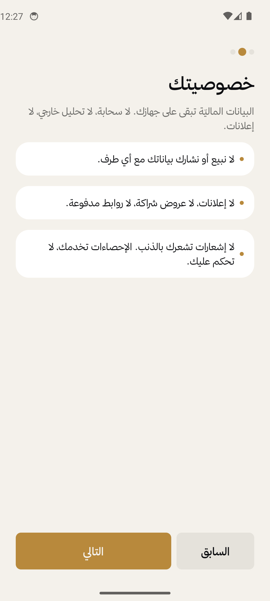
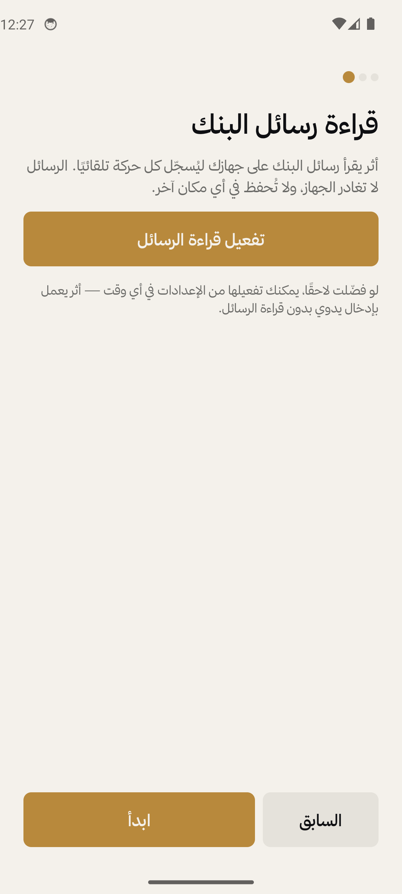
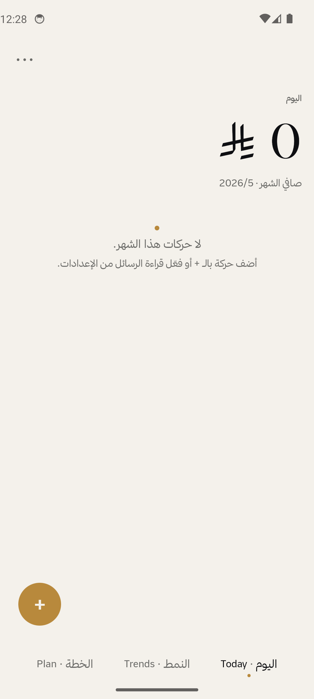
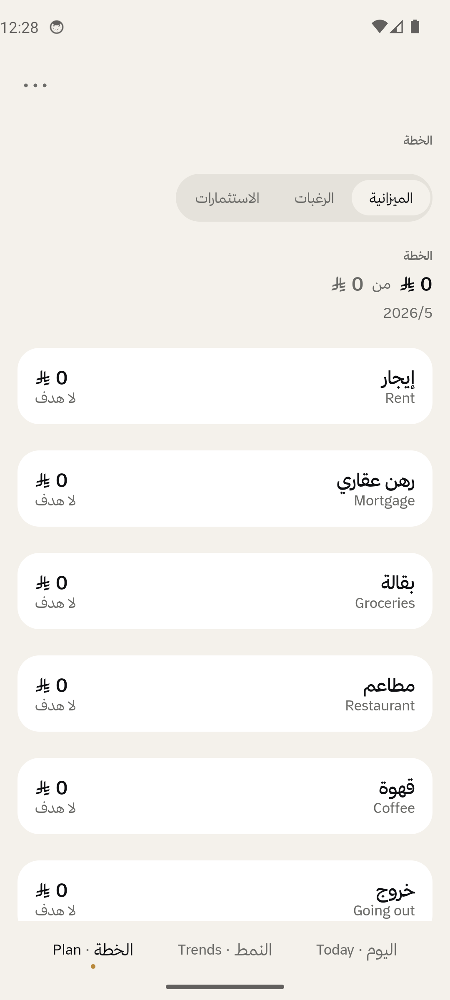
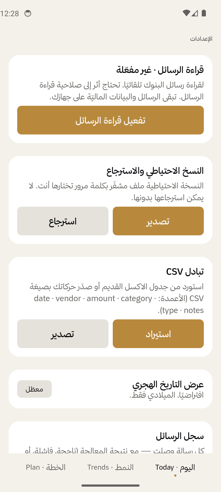
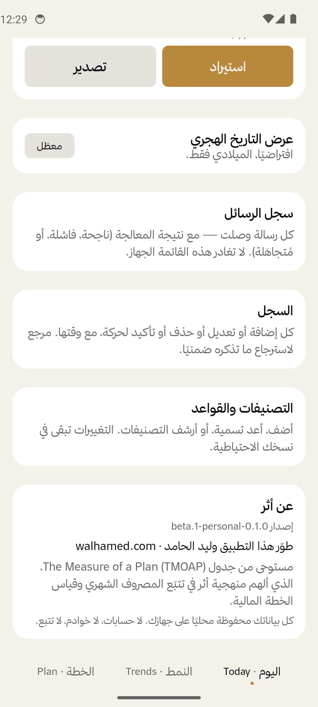

<p align="center">
  
</p>

<h1 align="center">أثر · Athar</h1>

<p align="center">
  <strong>The free, local-first replacement for "The Measure of a Plan" (TMOAP) budget Excel.</strong><br/>
  <em>Trace every riyal — or dollar, dirham, rupee, pound — you spend. Quietly. On your device. Without spreadsheets.</em><br/>
  <em>تتبع أموالك. بوضوح.</em>
</p>

<p align="center">
  <a href="LICENSE"></a>
  
  
  
  
  <a href=".github/workflows/build.yml"></a>
  
</p>

<p align="center">
  <a href="#how-it-works">How it works</a> ·
  <a href="#features">Features</a> ·
  <a href="#screenshots">Screenshots</a> ·
  <a href="#building">Building</a> ·
  <a href="#roadmap">Roadmap</a> ·
  <a href="#privacy">Privacy</a>
</p>

---

> **أثر · Athar** is a local-first Android app — an open-source, privacy-first replacement for the popular **"The Measure of a Plan" (TMOAP) personal finance Excel workbook**. It reads your bank SMS, parses every transaction, auto-categorizes against a 551+ merchant rule catalog plus local user-learned rules, and replaces a complex Excel budget workbook with three calm screens: **Today** · **Trends** · **Plan**. Arabic + English. Multi-currency (18 codes). Encrypted on-device. No cloud. No ads. No telemetry. Ever.

## Why · Replacing TMOAP

**The Measure of a Plan (TMOAP)** is a beloved personal-finance Excel workbook used by thousands worldwide to track monthly cash flow, savings rate, wishlists, and historical comparisons. It is rigorous, beautiful, and entirely manual — every transaction is typed in by hand.

Athar carries TMOAP's discipline (monthly cash flow → savings capacity → wishlist gating, historical period-vs-prior comparison, dashboard charts) into a phone that lives in your pocket and reads your bank SMS automatically. You get TMOAP-grade analysis without TMOAP's manual data-entry tax.

**Search keywords:** TMOAP replacement · The Measure of a Plan Excel alternative · open-source budget tracking app · personal finance spreadsheet replacement · monthly cash flow tracker · savings rate calculator · expense tracker without cloud · Excel budget Android · SMS budget app · privacy-first finance · multi-currency budget app · zero-knowledge expense tracker · Arabic budget app · Saudi budget tracker.

Other tools force a trade-off:
- A spreadsheet (TMOAP, YNAB-on-sheet, custom Google Sheets) that knows your categories but requires manual entry for every transaction
- A SaaS app (Mint, YNAB, Monarch, Copilot, Money Lover) that ingests transactions but sends your financial graph to a third-party server, runs ads, doesn't speak Saudi/Gulf banking, or doesn't work without a cloud account

**Athar bridges that gap**, locally and quietly. Your data never leaves the device unless you export it yourself.

## Features

#### Today (اليوم)
- ✅ One landmark net-flow number with **count-up animation**
- ✅ **Income + Expense pills** (olive / ember) — see your monthly inflow and outflow at a glance
- ✅ **Savings-rate caption** (e.g., "معدّل الادخار · 18٪") — the TMOAP discipline, on the home screen
- ✅ **Goals check** — a compact savings-rate target and emergency-fund cue pulled from Plan targets
- ✅ **Today section** at the top of the list filters to transactions where `date == today` so you instantly see what you spent today (with `Today's net · X SAR` subtitle in olive/ember). Below it: "This month's recent" for context.
- ✅ Pending tray for SMS-captured transactions awaiting your confirmation
- ✅ Swipe right to confirm · swipe left to dismiss · **bulk actions** for 5+ pending entries
- ✅ **Ember attention banner** when pending > 0 — "%d transactions awaiting review · Tap to review →" — impossible to miss above the net-flow number. Dust-color secondary banner appears below it when today had any auto-dismissed transactions, so parser false-negatives never go unnoticed.
- ✅ **Fail-safe ingestion (beta.15):** SMS that parse as transactions are NEVER auto-dismissed; if the categorizer is uncertain, the transaction lands in PENDING for explicit user review. Money never silently disappears. See `docs/adr/ADR-008-ingestion-fail-safe.md` for rationale.
- ✅ Auto-confirm transactions when category is already known (CategoryRule match); user fixes are recorded as new rules so the same merchant auto-confirms next time
- ✅ FAB to add a manual transaction in seconds, with recent-merchant quick-add chips that prefill merchant, amount, type, and category from your own history

#### Trends (النمط) — TMOAP-depth analysis
- ✅ Period selector: **month · 3 months · year · period-vs-prior · custom range**
- ✅ **Headline numbers card** with delta-vs-prior % and expense-as-%-of-income
- ✅ **Income · Expenses · Savings** breakdown with savings-rate %
- ✅ **Monthly Dashboard** — 3 panels (income / expense / savings) over the last 12 months, each with **budget-target line + computed average line** overlays (TMOAP "Income by Month / Expenses by Month / Savings by Month" parity)
- ✅ **Period-vs-prior comparison bars** for income/expense/savings (TMOAP "Historical Comparison" sheet parity)
- ✅ **Category comparison table** with delta in money + delta % per category
- ✅ **Proportional category split** horizontal stacked bar (pie-chart replacement — pies banned per design brief)
- ✅ **Tap a bar → 12-month drilldown** for that category, with monthly target overlay
- ✅ Top-8 category bar chart
- ✅ Hijri date display optional

#### Plan (الخطة)
- ✅ **Budget targets** per category with variance pills (over/under)
- ✅ **Editable monthly targets** — tap any row, type the number, save
- ✅ **Goals tab** — savings-rate target and emergency-fund target, computed from confirmed history and liquid accounts
- ✅ **Bills calendar** — Plan → Bills projects recurring rules 60 days ahead, highlights overdue items, and folds uncategorized pending transactions into the same scannable list
- ✅ **Wishlist** with savings-capacity math (NOW / WAIT until YYYY-MM / INFEASIBLE)
- ✅ **Wishlist** with TMOAP-style savings-capacity math — start month, desired horizon, remaining amount, needed/month, and NOW / WAIT until YYYY-MM / INFEASIBLE status
- ✅ **Family investments pool** with **percentage-based return entry**, proportional share %, delete pool/contributor
- ✅ **Recurring transactions** — define rent / salary / Netflix / utilities once; rules materialize into PENDING transactions on their due date

#### Ingestion + categorization (Saudi-first, universal-ready)
- ✅ **Al Rajhi SMS** parser (Arabic + English) — purchase, transfer, deposit, profit deposit, loan instalment, credit card payment, declined transactions, transfers between own accounts
- ✅ **STC Bank · Alinma · D360 · Barq** templates derived from real corpus, with date extraction so historical SMS sit in their correct months
- ✅ **User-defined templates** — paste a sample SMS from your bank, mark the anchor strings around the amount/merchant, and confirm the live parse preview before saving (W-4)
- ✅ **Spam-resistant pipeline** — `-AD` suffix block (CITC convention), sender allow-list, ~40 ignore patterns for OTP/promo/marketing (Tasaheal, "Buy X Get Y", "Earn 10,000")
- ✅ **Notification listener** path for Play-Store-safe distribution, with generic bank-app push parsing for common English/Arabic spend, income, and transfer alerts
- ✅ **Multi-currency capture** — foreign-card spend keeps both the original amount and the SAR equivalent
- ✅ **Self-transfer detection** — moves to your own savings account flagged as "Own account move" (savings), not expense
- ✅ **Auto-detected recurring patterns** — scans your confirmed history, surfaces "Same merchant, same amount, 3+ distinct months at similar day-of-month" candidates as suggestions you confirm with one tap
- ✅ **90-day historical SMS backfill** on first install
- ✅ Rule engine with **551 merchant seed rules** across 22 categories (beta.17 — expanded from 44 curated rules with 507 high-confidence AI-categorized patterns extracted from a 1,000-message real-world AlRajhi corpus + a friend's SMS history; rules auto-refresh on app upgrade)
- ✅ "Always categorize X as Y?" **learn-from-correction** loop — **as of beta.18 the learned rule is backfilled to every existing PENDING + DISMISSED row** matching the merchant pattern, not just future SMS. Picking "Always" for one Hemmah charge fixes every stranded Hemmah in one tap
- ✅ **Local category rule learning** — after three confirmed transactions for the exact same merchant all share one category, Athar creates an exact local rule so future matches stop asking. Explicit "Always" rules still win; ambiguous merchants are ignored
- ✅ Source of every categorization is **explainable** (rule id, confidence)

#### Settings + ops
- ✅ **Multi-currency display** — pick from 18 ISO-4217 codes (USD · EUR · GBP · AED · EGP · INR · PKR · TRY · SAR · KWD · QAR · BHD · OMR · JOD · CAD · AUD · CHF · JPY) with Arabic + English currency labels
- ✅ **Per-account ingestion routing** — add SMS sender aliases or card/account tails to each account so new bank messages land on the right checking, savings, or credit-card account instead of the manual seed account
- ✅ **AES-256-GCM encrypted backup** (Argon2-equivalent KDF, passphrase-protected)
- ✅ **CSV import + export** for Excel and bank-statement interop — import TMOAP/Athar CSVs or common statement layouts with description/amount or debit/credit columns; export annual data for your accountant
- ✅ **CSV import + export** for Excel interop — drop in your TMOAP transaction log to import; export annual data for your accountant
- ✅ **Annual accountant/tax PDF export** — pick a year in Settings and export income/expense totals, category totals, and the confirmed transaction list
- ✅ **First-run CSV import** — new users can bring a TMOAP / Excel transaction log into Athar during onboarding instead of hunting for the Settings exchange later
- ✅ **SQLCipher** database encryption at rest, key wrapped via Android Keystore
- ✅ **SMS audit log** — every parsed/failed/ignored SMS retained, never deleted
- ✅ **Support diagnostics export** — Settings writes a redacted JSON report with SMS parse counts, pseudonymous sender hashes, body-shape fingerprints/flags, failed-template groups, and redacted parser errors. No raw SMS body, sender, balance, card, or account numbers are included
- ✅ **SMS audit log** — every parsed/failed/ignored SMS retained, never deleted, with sender-health counts so failed banks and spammy senders are easy to spot after a backfill
- ✅ **Activity log** — every transaction edit, with timestamp
- ✅ **All transactions history (H-01, beta.12)** — searchable list of every transaction across all time, filter chips for status (All / Confirmed / Pending / Dismissed), type (Expenses / Income / Transfers), and source (SMS / notification / manual / import / recurring / share), tap any row to edit category or delete. Reachable from Settings → "All transactions"
- ✅ **Recover dismissed (beta.15)** — one-tap action moves every DISMISSED transaction back to PENDING so users on older builds can recover what was hidden by the now-removed auto-dismiss policy
- ✅ **SMS backfill scans entire inbox** (beta.11) — no 90-day cap; pass `daysBack: Int? = null` to scan all history
- ✅ **Rescan + clean** button — shows the pending count, asks for confirmation, then wipes the pending tray and re-runs backfill with the latest templates
- ✅ **Per-app language picker (beta.11)** — Follow system / Arabic / English; flips text + layout direction (RTL/LTR) on the fly via `CompositionLocalProvider(LocalLayoutDirection)`. Language card sits at the TOP of Settings for discoverability
- ✅ **Own-account list** — register the last-4 of your accounts so internal transfers are flagged as savings moves
- ✅ **Hijri date toggle**
- ✅ **Subscriptions screen (R-04, beta.17)** — recurring rules reframed as subscriptions with Active / Paused sections, monthly-total card, one-tap Active↔Paused toggle
- ✅ **Confirm-before-create sheet (R-03, beta.17)** — tapping a recurring suggestion opens a sheet to edit cadence (Monthly/Weekly/Yearly), day-of-month, and category before saving the rule
- ✅ **Bulk categorize with AI (beta.18)** — export every PENDING/DISMISSED/uncategorized transaction to CSV, run it through ChatGPT/Claude with the AI triage prompt, import the filled file back. Each row updates its transaction *and* records a merchant→category rule so future SMS auto-categorize. No API keys, no cloud round-trip — your personal merchant library grows permanently
- ✅ **Local category rule learning** — repeated confirmed exact-merchant/category history creates private priority-150 exact rules. No cloud, no community sharing, and no learning from ambiguous merchants
- ✅ **Reconcile to bank balance (beta.19)** — per-account "تسوية / Reconcile" chip. Enter your bank's actual balance; Athar inserts one manual adjustment transaction so the running balance matches. No silent history rewrite, full audit trail
- ✅ **Share your rules with the community (beta.20)** — Settings → "Help others · share your rules" exports only your "Always categorize X" merchant→category mappings as JSON, then opens a pre-filled GitHub issue. Maintainer reviews; accepted rules ship in the next release's seed for every user. Zero transaction data leaves your device
- ✅ **Home-screen widgets (beta.21+)** — three Glance widgets: Month summary (net + Income/Expense/Net-worth pills), Today snapshot (today's net + pending count), and Pending list (top-3 pending transactions with Confirm / Dismiss / Categorize shortcuts). Long-press home screen → Widgets → Athar
- ✅ **Support diagnostics export** — Settings → "Support diagnostics" creates `athar-support-diagnostics.json`, a bounded redacted parser report for maintainers. It includes counts, sender hashes, body-shape fingerprints/flags, failed-template groups, and redacted errors only — no raw SMS bodies, balances, or account/card numbers
- ✅ **Home-screen widgets (beta.21)** — three Glance widgets: Month summary (net + Income/Expense/Net-worth pills), Today snapshot (today's net + pending count), and Pending list (top-3 pending transactions). Long-press home screen → Widgets → Athar
- ✅ **Reconciliation no longer inflates expenses (beta.22)** — manual adjustment transactions (`تسوية يدوية`) still move net worth but are excluded from monthly spend/income totals, Trends bars, Plan actuals, and widget snapshots
- ✅ **Update-availability nudge via Obtainium (beta.23)** — Settings → "تابع التحديثات / Stay up to date" hands off update-tracking to Obtainium via a deep link. Athar stays fully offline (no INTERNET permission); Obtainium watches the GitHub releases page and notifies you when a new build ships
- ✅ **Recurring rules management** with auto-detected suggestions, manual "Run now", and WorkManager auto-run so due subscriptions land in Pending without visiting Settings
- ✅ Categories management (rename, archive, reorder, custom adds)

## Screenshots

Captured from the `v0.1.0-beta.1` signed APK running on a Pixel 6 / Android 14 emulator.

<table>
  <tr>
    <td align="center"><br/><sub>Onboarding · welcome</sub></td>
    <td align="center"><br/><sub>Onboarding · privacy</sub></td>
    <td align="center"><br/><sub>Onboarding · SMS perm</sub></td>
    <td align="center"><br/><sub>Today · empty state</sub></td>
  </tr>
  <tr>
    <td align="center"><br/><sub>Trends · empty</sub></td>
    <td align="center"><br/><sub>Plan · budget targets</sub></td>
    <td align="center"><br/><sub>Settings</sub></td>
    <td align="center"><br/><sub>About · credits</sub></td>
  </tr>
</table>

## How it works

```
┌────────────────────────────────────────────────────────────────────┐
│  SMS broadcast      Notification listener      Manual entry        │
│       │                       │                      │              │
│       └─────────┬─────────────┴──────────┬──────────┘              │
│                 ▼                        ▼                          │
│           RawIngestEvent           Transaction (CONFIRMED)          │
│                 │                        │                          │
│                 ▼                        │                          │
│    SmsIngestionPipeline                  │                          │
│      ┌─ audit log (PARSED/FAILED/IGNORED)│                          │
│      ├─ parser (Al Rajhi templates)      │                          │
│      ├─ categorizer (rules → classifier) │                          │
│      └─ persist (PENDING)                │                          │
│                 ▼                        ▼                          │
│         ╔══════════════════════════════════════╗                    │
│         ║  Encrypted Room DB (SQLCipher)       ║                    │
│         ║  key wrapped via AndroidKeyStore     ║                    │
│         ╚══════════════════════════════════════╝                    │
│                 │                                                   │
│        ┌────────┼────────┬──────────┐                              │
│        ▼        ▼        ▼          ▼                              │
│      Today    Trends   Plan       Settings                          │
└────────────────────────────────────────────────────────────────────┘
```

The architecture intentionally separates each ingestion source from the parse/categorize/persist pipeline so the distribution flavor (sideload vs Play-Store-eligible) is a config change, not a rewrite.

See [`docs/adr/`](docs/adr/) for the decision records:
- **ADR-001** — Stack: Kotlin 2.1 + Compose Material 3 + Hilt + Room + multi-module
- **ADR-002** — Local-first: no backend, no telemetry, ever
- **ADR-003** — Encryption at rest: SQLCipher + Keystore-wrapped DB key
- **ADR-004** — MVP status after 24 build waves

## Tech stack

| Layer | Choice |
|---|---|
| Language | Kotlin 2.1.0 |
| UI | Jetpack Compose · Material 3 |
| DI | Hilt 2.54 |
| Persistence | Room 2.6 · **SQLCipher 4.6** (AES-256-GCM, AndroidKeyStore-wrapped key) |
| Async | Coroutines + Flow |
| Navigation | Compose Navigation 2.8 (single-activity, type-safe routes) |
| Charts | Custom Compose primitives (horizontal bar + monthly vertical bar) |
| Date/time | kotlinx-datetime · `java.time.chrono.HijrahDate` for Hijri |
| Money | `java.math.BigDecimal` — never `Float`/`Double` |
| Build | Gradle 8.10 · convention plugins via `build-logic/` included build · version catalog |
| Tests | JUnit 5 · Truth · Turbine · Paparazzi (scaffolded) · Maestro (10 flows) |
| Typography | [Thmanyah typeface](https://github.com/thmanyah/Thmanyah-Type) — sans + serif-display + serif-text |
| Logging | Timber (debug); no Crashlytics (privacy commitment) |

## Building

```bash
# 1. JDK 17 + Android SDK
#    Either install Android Studio (bundles both), or:
#      JDK:  https://adoptium.net/  (Temurin 17)
#      SDK:  Android command-line tools, then `sdkmanager "platforms;android-35" "build-tools;35.0.1"`

# 2. Point the build at your SDK
echo "sdk.dir=/path/to/Android/Sdk" > local.properties

# 3. Bootstrap the Gradle wrapper (only first time)
gradle wrapper --gradle-version 8.10.2

# 4. Build
./gradlew :app:assemblePersonalFullSmsDebug

# 5. Install on a connected device
./gradlew :app:installPersonalFullSmsDebug
# or:
adb install app/build/outputs/apk/personalFullSms/debug/app-personalFullSms-debug.apk
```

Two flavors:

| Flavor | Permissions | Distribution path |
|---|---|---|
| **personalFullSms** | RECEIVE_SMS, READ_SMS | Sideload only — your own daily-driver build |
| **storeSafe** | No SMS perms | Play-Store-eligible — uses NotificationListenerService, manual entry, CSV import |

## Tests

```bash
./gradlew test                                   # all JVM unit tests
./gradlew :ml:categorizer:test                   # one module
./gradlew :app:assemblePersonalFullSmsDebug :app:assembleStoreSafeDebug
./gradlew :app:lintPersonalFullSmsDebug :app:lintStoreSafeDebug
./gradlew connectedAndroidTest                   # instrumented (needs emulator/device)
maestro test .maestro/flows/                     # 10 E2E flows
```

## Roadmap

### Shipped in v0.1.0-beta.1 → current

**Foundations (beta.1):**
- ✅ Phase 0 foundations · 15 Gradle modules · build-logic convention plugins
- ✅ Excel parity for manual entry (M-01..M-13)
- ✅ Pending tray with swipe gestures (S-17..S-19)
- ✅ Hijri date toggle (P-07)
- ✅ SQLCipher encryption-at-rest with Keystore-wrapped key (ADR-003)
- ✅ AES-256-GCM JSON backup + restore · CSV import + export
- ✅ Wishlist + Family Investments (Phase 4)
- ✅ Trends drilldown chart (M-07)
- ✅ SMS audit + Activity log (S-21, S-23, P-08)
- ✅ Al Rajhi SMS parsing + categorization (S-01..S-09)

**Bank coverage + sustainability (beta.2 → beta.4):**
- ✅ Al Rajhi real-corpus templates (12 message types: PoS, online, transfers, deposits, profit, loan)
- ✅ STC Bank · Alinma · D360 · Barq templates
- ✅ User-defined SMS templates (W-4) — onboard your bank without code
- ✅ Spam-resistant ingestion pipeline (ADR-006): sender allow-list + `-AD` block + 40 ignore patterns
- ✅ Date extraction from SMS body (7 formats) so historical SMS sit in their correct months
- ✅ Auto-confirm by category when confidence is high; uncertain parsed transactions stay in Pending for explicit user review
- ✅ Self-transfer / own-account detection
- ✅ Investment percentage-based returns + delete pool/contributor
- ✅ TMOAP-seeded private build (gitignored) for the developer's own data — public APK stays clean

**TMOAP-depth analysis (beta.5):**
- ✅ G-9 — Monthly Income/Expense/Savings bar panels with budget-target + average overlay lines
- ✅ Period-vs-prior comparison bars (income/expense/savings)
- ✅ Headline numbers card with savings rate + expense-as-%-of-income
- ✅ Category comparison table with delta money + delta %
- ✅ Proportional category split (horizontal stacked bar)
- ✅ Custom date-range selector on Trends

**Global sprint Tier 1 (beta.6 → beta.8):**
- ✅ **G-1** — Multi-currency display (18 ISO-4217 codes with Arabic + English labels, currency picker in Settings)
- ✅ **G-2** — Income visibility (income + expense pills + savings-rate on Today header)
- ✅ **G-3** — Recurring transactions (rent / salary / Netflix / utilities — manual rules + auto-detected suggestions from history)
- ✅ **G-9** — TMOAP-depth Trends

**Global sprint Tier 1 continued (beta.9):**
- ✅ **G-4** — Multi-account + net worth view: Room v4→v5 migration adds 6 columns to the account table (openingBalance, sortOrder, archivedAt, notes, updatedAt); legacy `DEBIT/CREDIT` enum remapped to `CHECKING/SAVINGS/CREDIT_CARD/CASH/INVESTMENT/OTHER`. New `AccountRepositoryImpl.observeNetWorth()` aggregates `openingBalance + Σ(CONFIRMED transactions)` per account, returns the live net-worth flow used by the Today header pill and the new Accounts screen (CRUD + archive + edit + per-currency breakdown). Manual seed account is now a first-class CASH account, non-deletable but renameable/archivable.
- ✅ **G-6** — Custom date-range selector on Plan: Plan now has the same period picker as Trends (month / 3-month / year / custom). Monthly targets scale by average month-length of the selected range, with a caption (×N multiplier) so budget-vs-actual stays apples-to-apples.
- ✅ **G-5** — Localization (full): locale picker, DataStore persistence, `attachBaseContext` Configuration override + Compose `LocalLayoutDirection` provider. **~300 user-facing strings extracted** to `values/` (Arabic default) + `values-en/` across app:onboarding, core:design-system, feature:today, feature:trends, feature:plan, feature:settings. ViewModels emit typed sealed states (`AccountError`, `BackupStatus.ExportSuccess` / `ExportFailure(detail)`, etc.) and the Composable layer resolves them to `stringResource()`, so VMs stay pure (no Context dependency). Visually QA'd end-to-end on emulator: switched to English → all UI English + LTR (chart legends "Average/Target", swipe-row "Confirm/Dismiss", FAB + settings-gear flip sides, category-picker search field translates); switched back to Arabic → all UI Arabic + RTL. Remaining persisted-data debt (acceptable): the auto-seeded "النقدي" Cash-account name (user-renameable), SMS self-transfer merchant/notes (stored in DB at ingest time; future work would inject ApplicationContext or use a sentinel value resolved at render).

**User-testing patches (beta.11–beta.15):**
- ✅ **H-01 / All-transactions history (beta.12)** — searchable + filterable list of every transaction; user can drill in from Settings, fix categories one by one, learn-rule propagates corrections to future SMS.
- ✅ **Today-section filter + pending banner (beta.13)** — Today list now splits today's transactions from this-month-recent; ember banner above the header shouts "%d transactions awaiting review" with tap-to-history CTA. Stale-edit-sheet regression fixed with `key(tx.id) { … }` + synchronous state reset on `EditTransactionViewModel.load()`.
- ✅ **Dismissed-today banner (beta.14)** — dust-color secondary banner surfaces parser false-negatives so the user catches transactions Athar discarded.
- ✅ **Fail-safe ingestion (beta.15, [ADR-008](docs/adr/ADR-008-ingestion-fail-safe.md))** — auto-dismiss removed entirely from the pipeline. Anything that successfully parses as a transaction lands in CONFIRMED (categorizer matched) or PENDING (user must decide). Never DISMISSED automatically. Money no longer silently disappears. One-tap **"Recover dismissed transactions"** Settings action moves every legacy DISMISSED row back to PENDING for existing users.
- ✅ **AI triage workflow (R-02, [docs/AI_SMS_TRIAGE_PROMPT.md](docs/AI_SMS_TRIAGE_PROMPT.md))** — copy-paste prompt teaches an external AI (ChatGPT/Claude/Gemini) to read a bulk SMS export and return JSON with `transactions` + new `parser_templates` + new `categorization_rules`. Developer pastes JSON back, merges into `seed_rules.json` and per-bank template files. Lets the user expand bank coverage from any device's SMS without code changes per batch.

### Current validation status

- ✅ The recovered PR stack (#11–#30) is integrated locally on `dev/integration-recovered-stack`; details are in [`docs/RECOVERY_2026-06-13.md`](docs/RECOVERY_2026-06-13.md).
- ✅ JVM tests, both debug APK builds, and both app lint variants pass with JDK 17.
- ✅ The scoped `dev/today-goals-nudge` branch also passes `:feature:today:test` plus the full JVM test/build/lint stack after adding the Today Goals check.
- ⏳ Device E2E and screenshot UI audit still need a physical Android device or a working accelerated emulator. On 2026-06-13 the local AVD could not boot because firmware virtualization was disabled, and `adb devices -l` still returned no attached devices during this branch validation.

### In flight / remaining

| ID | Feature | Status | Effort | Notes |
|---|---|---|---|---|
| QA-01 | Runtime E2E + UI audit | ⏳ | 0.5–1 day | Needs physical Android device or accelerated emulator |
| G-7 | Bill reminders | ⏳ | 1.5 days | Plan → Bills upcoming view shipped; push reminders remain follow-up |
| G-8 | Manual transaction UX upgrades | ◐ | 1.5 days | ✅ Recent-merchant autocomplete + quick-add chips · ⏳ voice entry · receipt photo |
| G-10 | Savings-rate goals + emergency fund | ✅ | — | Plan → Goals tab plus Today Goals check shipped; device visual QA remains under QA-01 |
| G-11 | Broader notification handlers | ◐ | 3 days | Generic bank-app push parser shipped; app-specific handlers remain follow-up |
| G-12 | Bank statement / CSV / OFX / QFX import wizard | ◐ | 3 days | CSV header auto-detect shipped; preview, manual mapping, OFX/QFX/MT940 still planned |
| G-13 | Zero-knowledge sync to companion devices | ⏳ | 5 days | E2E-encrypted via Dropbox / Drive / iCloud / WebDAV / S3 — user holds the key |
| G-14 | Tax-export PDF for accountants | ✅ | 2 days | Annual category totals + transaction list in user's locale |

Full gap analysis: [`docs/ROADMAP_GLOBAL.md`](docs/ROADMAP_GLOBAL.md).

### Deferred (technical-debt only)

- ⏳ TFLite merchant classifier (rule engine handles ~90% of cases)
- ⏳ Paparazzi snapshot baselines (need to record on a real machine)
- ⏳ Macrobenchmarks (need a device)
- ⏳ XLSX direct import (CSV path covers the migration today)

## Privacy

Athar makes three commitments (Master Brief §2.2, enforced in ADR-002 + ADR-003):

1. **No cloud transit of financial data without your explicit action.** The only data that leaves the device is the AES-256-GCM backup file, which you save where you want.
2. **No ads, partnerships, affiliate links, telemetry, or third-party crash reporting.**
3. **No friction that makes you feel bad.** No streaks, no shame notifications, no scream red bars.

The DB is encrypted at rest with a 256-bit key resident in `AndroidKeyStore`. Without the device's secure hardware, the key is undecryptable. See [`SECURITY.md`](SECURITY.md).

## Contributing

PRs welcome. See [`CONTRIBUTING.md`](CONTRIBUTING.md) for the workflow and the spec-first loop the codebase was built with. The single source of truth is [`Athar_Master_Brief.md`](Athar_Master_Brief.md) — please read it before opening a PR that adds a feature.

## License

[Apache License 2.0](LICENSE). Bank-template strings in `ingestion:sms-parser` are derived from observed SMS bodies (anonymized) and are released under the same terms.

## Credits

Developed by **Waleed Alhamed** — [walhamed.com](https://walhamed.com)

Inspired by [**The Measure of a Plan (TMOAP)**](https://themeasureofaplan.com) budget tracking workbook by Tudor Mihailescu, whose monthly cash-flow + historical-comparison + savings-capacity discipline shaped Athar's Trends and Plan screens. Athar carries that spreadsheet's clarity into a phone that lives in your pocket — and removes the manual data-entry tax that TMOAP, by virtue of being a spreadsheet, can never eliminate.

If you were searching for "TMOAP for mobile", "The Measure of a Plan Android app", "open-source TMOAP", "TMOAP without Excel", "automated budget tracker that replaces my spreadsheet", "privacy-first alternative to YNAB / Mint / Monarch / Copilot", or "Saudi / Gulf / Middle East budget app with SMS reading" — Athar is the project you're looking for.

---

<p align="center">
  <sub>Built one disciplined wave at a time. The Excel sheet retires when Athar ships its v1.0.</sub>
</p>
